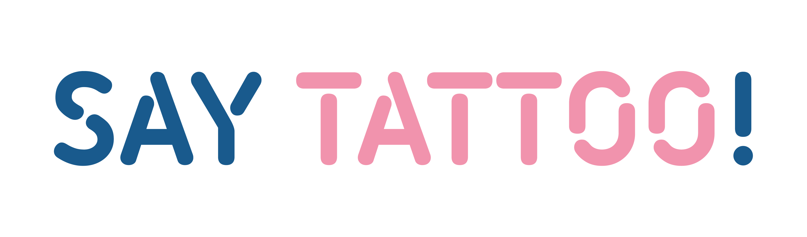

# Say Tattoo! 🖋️ 

  

  
  
  
  

---

### 🌟 El Proyecto
**Say Tattoo!** es una plataforma Full Stack desarrollada durante el Bootcamp de **Neoland**. Su objetivo es crear un ecosistema digital donde tatuadores y usuarios conviven, permitiendo la exposición de portfolios profesionales y el descubrimiento de nuevos artistas en España.

### 🛠️ Stack Tecnológico

* **Front-End:** Angular 16, TypeScript, SCSS, Bootstrap.
* **Back-End:** Java, Spring Boot, Spring Security (JWT).
* **Base de Datos:** MySQL con persistencia de datos relacionales.

### 🚀 Funcionalidades Clave (Extraídas de la Documentación)
* **Gestión de Portfolios:** Espacio dedicado para que el tatuador exponga trabajos reales.
* **Buscador Inteligente:** Filtrado de artistas por **estilos** y **ciudades**.
* **Seguridad:** Registro y Login con roles diferenciados (Tatuador vs. Usuario).
* **Inspiración:** Galería de trabajos para usuarios que buscan ideas para su próximo tatuaje.

### 📈 Conclusiones y Evolución
Como indica la documentación del proyecto, Say Tattoo! es una plataforma **escalable**. 
> "La idea original era sencilla, pero el proyecto creció permitiendo añadir funcionalidades como sistemas de favoritos personalizables y botones de gestión de cuenta (RGPD)."

---

## 🔗 Enlaces de interés
- **Demo en vivo:** [Ver Proyecto Online](https://sandradetena.github.io/Say_Tattoo-_ProyectoFullStack/)
- **Portfolio Principal:** [Sandra De Tena](https://sandradetena.github.io/)

---

Desarrollado por Sandra De Tena Gómez - Full Stack Developer

